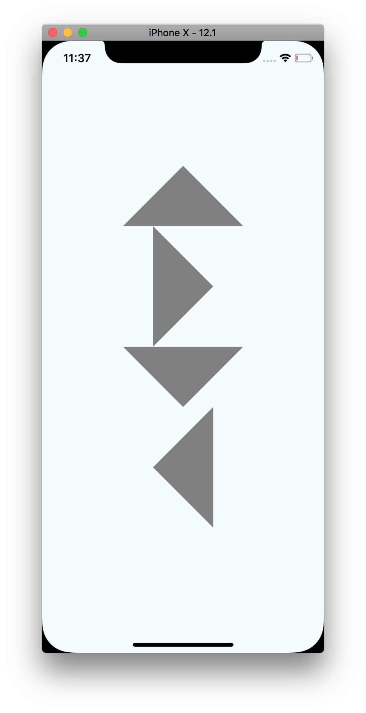

# React Native test app

testing PR: https://github.com/facebook/react-native/pull/23402

```bash
React Native Environment Info:
    System:
      Model Name: MacBook Pro
      Model Identifier: MacBookPro11,3
      Processor Name: Intel Core i7
      Processor Speed: 2.5 GHz
      Number of Processors: 1
      Total Number of Cores: 4
      L2 Cache (per Core): 256 KB
      L3 Cache: 6 MB
      Memory: 16 GB
      Boot ROM Version: 149.0.0.0.0
      SMC Version (system): 2.19f12
    Binaries:
      Node: v8.14.0
      Yarn: 1.12.3
      npm: 6.7.0
      Watchman: 4.9.0
    SDKs:
      iOS SDK:
        Platforms: iOS 12.1, macOS 10.14, tvOS 12.1, watchOS 5.1
    IDEs:
      Xcode: 10.1/10B61
    npmPackages:
      react: 16.6.3 => 16.6.3
      react-native: github:zhongwuzw/react-native#remote-master
    npmGlobalPackages:
      react-native-cli: 2.0.1
```



